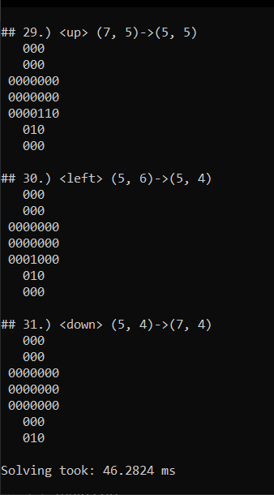

# Peg Solitaire solver
## Prepare board
../PegSolitaireBoard.txt file contains board like this:
```cmd
/////////
///111///
///111///
/1111111/
/1110111/
/1111111/
///111///
///111///
/////////
E
```
## Solver results
```cpp
PATH:
## 1.) <down> (2, 4)->(4, 4) ## 2.) <right> (3, 2)->(3, 4) ## 3.) <down> (1, 3)->(3, 3) ## 4.) <left> (1, 5)->(1, 3) ## 5.) <left> (3, 4)->(3, 2) ## 6.) <right> (3, 1)->(3, 3) ## 7.) <up> (3, 5)->(1, 5) ## 8.) <left> (3, 7)->(3, 5) ## 9.) <up> (4, 3)->(2, 3) ## 10.) <down> (1, 3)->(3, 3) ## 11.) <right> (4, 1)->(4, 3) ## 12.) <up> (4, 3)->(2, 3) ## 13.) <up> (4, 5)->(2, 5) ## 14.) <down> (1, 5)->(3, 5) ## 15.) <left> (4, 7)->(4, 5) ## 16.) <up> (4, 5)->(2, 5) ## 17.) <up> (6, 3)->(4, 3) ## 18.) <right> (5, 1)->(5, 3) ## 19.) <up> (5, 3)->(3, 3) ## 20.) <down> (2, 3)->(4, 3) ## 21.) <right> (4, 3)->(4, 5) ## 22.) <up> (5, 5)->(3, 5) ## 23.) <down> (2, 5)->(4, 5) ## 24.) <left> (5, 7)->(5, 5) ## 25.) <right> (5, 4)->(5, 6) ## 26.) <up> (7, 5)->(5, 5) ## 27.) <down> (4, 5)->(6, 5) ## 28.) <right> (7, 3)->(7, 5) ## 29.) <up> (7, 5)->(5, 5) ## 30.) <left> (5, 6)->(5, 4) ## 31.) <down> (5, 4)->(7, 4)

## 1.) <down> (2, 4)->(4, 4)
   111
   101
 1110111
 1111111
 1111111
   111
   111

## 2.) <right> (3, 2)->(3, 4)
   111
   101
 1001111
 1111111
 1111111
   111
   111

...

## 30.) <left> (5, 6)->(5, 4)
   000
   000
 0000000
 0000000
 0001000
   010
   000

## 31.) <down> (5, 4)->(7, 4)
   000
   000
 0000000
 0000000
 0000000
   000
   010

Solving took: 46.5396 ms
```

## Screenshot



