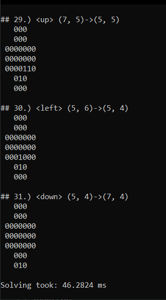

# Peg Solitaire solver
## Prepare board
../PegSolitaireBoard.txt file contains board like this:
```cmd
/////////
///111///
///111///
/1111111/
/1110111/
/1111111/
///111///
///111///
/////////
E
```
## Solver results
```cpp
PATH:
## 1.) <down> (2, 4)->(4, 4) ## 2.) <right> (3, 2)->(3, 4) ## 3.) <down> (1, 3)->(3, 3) ## 4.) <left> (1, 5)->(1, 3) ## 5.) <left> (3, 4)->(3, 2) ## 6.) <right> (3, 1)->(3, 3) ## 7.) <up> (3, 5)->(1, 5) ## 8.) <left> (3, 7)->(3, 5) ## 9.) <up> (4, 3)->(2, 3) ## 10.) <down> (1, 3)->(3, 3) ## 11.) <right> (4, 1)->(4, 3) ## 12.) <up> (4, 3)->(2, 3) ## 13.) <up> (4, 5)->(2, 5) ## 14.) <down> (1, 5)->(3, 5) ## 15.) <left> (4, 7)->(4, 5) ## 16.) <up> (4, 5)->(2, 5) ## 17.) <up> (6, 3)->(4, 3) ## 18.) <right> (5, 1)->(5, 3) ## 19.) <up> (5, 3)->(3, 3) ## 20.) <down> (2, 3)->(4, 3) ## 21.) <right> (4, 3)->(4, 5) ## 22.) <up> (5, 5)->(3, 5) ## 23.) <down> (2, 5)->(4, 5) ## 24.) <left> (5, 7)->(5, 5) ## 25.) <right> (5, 4)->(5, 6) ## 26.) <up> (7, 5)->(5, 5) ## 27.) <down> (4, 5)->(6, 5) ## 28.) <right> (7, 3)->(7, 5) ## 29.) <up> (7, 5)->(5, 5) ## 30.) <left> (5, 6)->(5, 4) ## 31.) <down> (5, 4)->(7, 4)

## 1.) <down> (2, 4)->(4, 4)
   111
   101
 1110111
 1111111
 1111111
   111
   111

## 2.) <right> (3, 2)->(3, 4)
   111
   101
 1001111
 1111111
 1111111
   111
   111

...

## 30.) <left> (5, 6)->(5, 4)
   000
   000
 0000000
 0000000
 0001000
   010
   000

## 31.) <down> (5, 4)->(7, 4)
   000
   000
 0000000
 0000000
 0000000
   000
   010

Solving took: 46.5396 ms
```

## Screenshot



///////////////////////////////////////////////////////////////////////////////////


# cpp-iz-teorije-v-prakso
Napredna delavnica: C++ iz teorije v prakso

C++ program solving Peg solitaire game
========================================

About Peg Solitaire.
----------------------
Peg solitaire (or Solo Noble) is a single player board game involving movement of pegs on a board with holes. In the United Kingdom the game is referred to as Solitaire while the card games are called Patience. The game is also known as Brainvita (especially in India). The first evidence of the game can be traced back to 1697.  More: http://en.wikipedia.org/wiki/Peg_solitaire

Game rules.
--------------------
The rules of Peg solitaire are similar to Checkers, in that a peg can jump over another peg as long as there is an empty hole on the other side.  Once a peg has been jumped over, it is removed from the board.  

The game starts with all the holes on the board filled with a peg except the hole in the center, which is empty. The first move begins with a peg jumping over another peg into an empty hole. A peg can jump left, right, up or down but cannot jump diagonally.  A peg can only jump one peg at a time, but as with Checkers, a peg can make a series of multiple jumps if there are open holes. Play continues with a peg jumping over another peg into an empty hole until there are no possible moves left.   

Winning the game.
----------------------
The game is won when all of the pegs are removed except one (the position of the last peg can be on arbitrary field). 
More: http://www.ehow.com/list_6181682_peg-solitaire-rules.html

Problem complexity
----------------------
For the version with 33 holes and 32 pegs (The English Board) of Peg Solitaire there are 577,116,156,815,309,849,672 different game sequences (577+ quintillion possible games), with 40,861,647,040,079,968 solutions. (Source: http://www.durangobill.com/Peg33.html).

An algorithm which blindly checks all the possibilities will not work quickly, and even with a very fast machine it would take years to solve.

```
  Start solving:
  111
  111
1111111
1110111
1111111
  111
  111
---------------
  111
  111
1111111
1110111
1111111
  111
  111

  111
  111
1111111
1111001
1111111
  111
  111

[ ... omitted ...]

  000
  000
0000000
0000000
0001000
  010
  000

  000
  000
0000000
0000000
0000000
  000
  010
```
Screenshots from the program and one of a solution:


Other useful links:
---------------------
Online game: http://www.coolmath-games.com/0-pegsolitaire/ (can be used for testing the solution)
How to solve the game YouTUbe video: https://www.youtube.com/watch?v=33UgfA3jt7s
